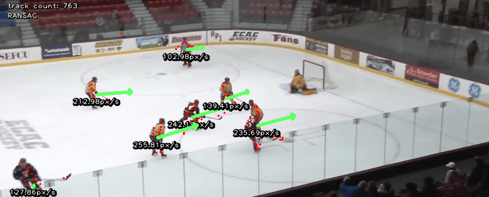

# optical-flow
## EE422 Final Project - Hockey Player Tracker

Uses the Lucas-Kanade sparse optical flow algorithm to calculate relative hockey player speed and position. 
Uses feature tracking and back-tracking for match verification
between frames. Finds homography between reference and current views
and uses RANSAC to determine outliers. Clusters outliers using K-means
clustering. It is able to determine the relative speed of the players, and their general locations.
#### Paper and Slides
For more information, see our [paper](data/Real-Time_Tracking_of_Hockey_Players_with_Amatuer_Video_Tracking.pdf) or our [slides](data/Project_Presentation.pdf).